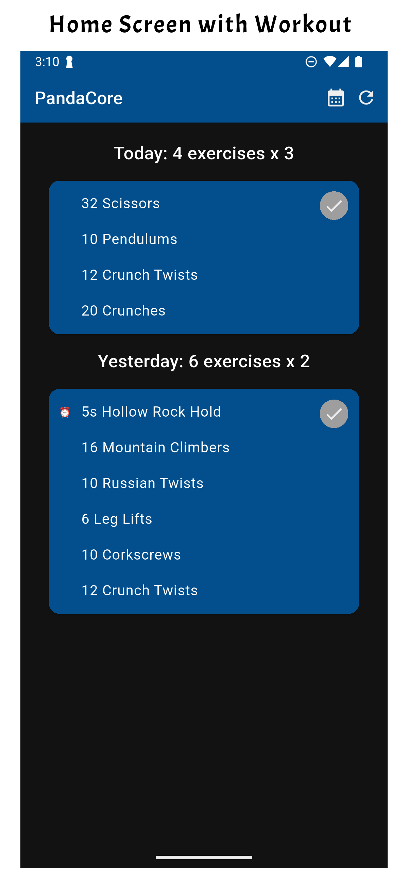
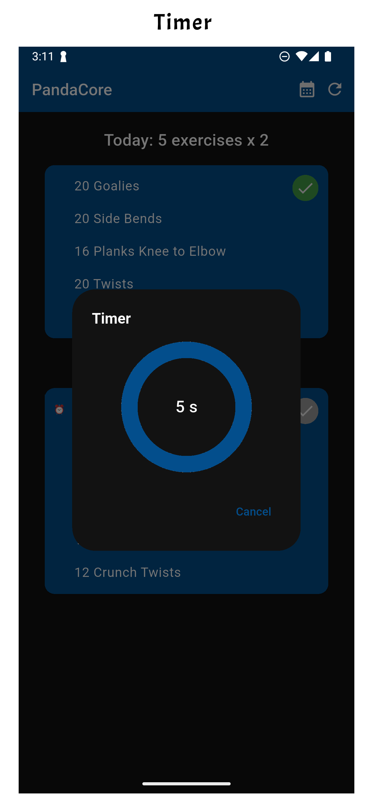
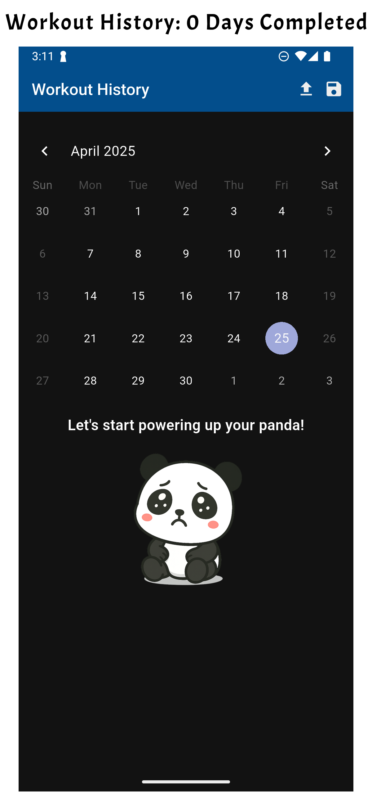

# PandaCore App

A simple mobile app built with Flutter that makes core workouts engaging and fun, with something new each day. Meant to be a no-frills, offline app, not requiring creation or access to any accounts.

This app lets you generate a new workout each day, includes a built-in timer, lets you see your workout history, and makes it easy to log and save your progress.

## Features

- **Randomized ab routines**: Generates a randomized workout routine with varying sets and repetitions.
- **Exercise timer**: Displays a countdown timer with a progress bar and plays a chime upon completion.
- **Activity log**: Tracks completed workouts and displays them in a calendar view.
- **Progress import and export**: Allows users to import and export their workout history as a CSV file.

## Screenshots
<div style="text-align: left;">
  
  
  
  
  
  
  
</div>

## Getting Started

### Prerequisites

- **Flutter** is required to build the app for both Android and iOS. To install Flutter, follow the instructions on the official Flutter website: [Flutter Installation Guide](https://flutter.dev/docs/get-started/install).
- **Android SDK** is needed to develop and run the app on Android devices. The Android SDK is included with Android Studio. Download and install **Android Studio**: [Download Android Studio](https://developer.android.com/studio).
- Once you have Flutter and the required SDKs installed, run `flutter doctor` to check for any missing dependencies and verify your environment setup.

### Installation

1. Clone the repository:
   ```bash
   git clone https://github.com/AMWen/pandacore.git
   cd pandacore
    ```

2. Install dependencies:
```bash
flutter pub get
```

3. Once you're ready to release the app, you can generate a release APK using the following commands:

For android:
```bash
flutter build apk --release
```

See instructions for [Signing the App for Flutter](https://docs.flutter.dev/deployment/android#sign-the-app) and [Uploading Native Debug Symbols](https://stackoverflow.com/questions/62568757/playstore-error-app-bundle-contains-native-code-and-youve-not-uploaded-debug)

You may also need to remove some files from the bundle if using a MacOS.
```bash
zip -d Archive.zip "__MACOSX*"
```

For iOS (need to create an an iOS Development Certificate in Apple Developer account):
```bash
flutter build ios --release
```

### Project Structure

```bash
lib/
├── data/
│   └── models/
│       └── exercise_model.dart
│   └── services/
│       └── localdb_service.dart
│       └── workout_generator.dart
│   └── widgets/
│       └── countdown_widget.dart
│   └── constants.dart
├── screens/
│   ├── history_screen.dart
│   └── home_screen.dart
├── utils/
│   └── file_utils.dart
├── main.dart
assets/
└── sounds/
    └── alarm.mp3
pubspec.yaml
```